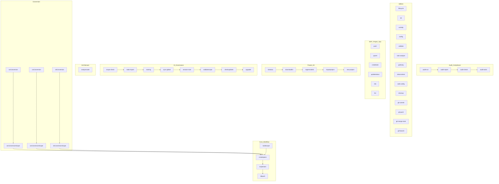

# wxHelp — wxAI Command Reference

---

## wxAI Command List

- buildscope — Guided scope drafting
- createspecs — Create specs and enforce test plan
- implement — Execute implementation plan
- dbpush — Validate and push all data to database
- audit-run, audit-report, audit-check, audit-tasks — Audit and compliance
- lifecycle, qa, help (wxHelp), config, validate, task-analyze, gateway, clearcontext, web-config, cleanup, git-commit, git-push, git-merge-main, git-branch — Utilities
- push, upsert, createtask, updatestatus, link, list — MCP Project Ops
- kitstatus, downloadkit, regeneratekit, importproject, new-project — Project Kit
- scope-check, todo-import, training, sync-global, session-start, validatescope, checkupdates, upgrade — AI Governance
- analyzecode — Architecture (wxICA drift audit + deepening exploration)
- wxConversion — WinDev/WebDev conversion stage 1 (PCSoft technical-doc PDF → readable Markdown under pre-convert/ + regenerated pages; Design stage)
- wxConversionScope — WinDev/WebDev conversion stage 2 (turn the converted artifacts into Scope-of-Project docs, BuildScope-style + resumable; Design stage)
- cwConversion — Clarion conversion stage 1 (SoftVelocity/PCSoft TXA/TXD/.clw source → readable Markdown under pre-convert/ + regenerated windows + DB schema with real FKs; Design stage)
- cwConversionScope — Clarion conversion stage 2 (turn the converted artifacts into Scope-of-Project docs, BuildScope-style + resumable, Clarion-aware gap-pass; Design stage)
- vbConversion — Visual Basic 6 conversion stage 1 (.vbp/.frm/.bas/.cls source → readable Markdown under pre-convert/ + regenerated forms + reconstructed DB model; Design stage)
- vbConversionScope — Visual Basic 6 conversion stage 2 (turn the converted artifacts into Scope-of-Project docs, BuildScope-style + resumable, VB6-aware gap-pass; Design stage)

> For details on each command, see the full help.md or run `wxai help <command>`.
