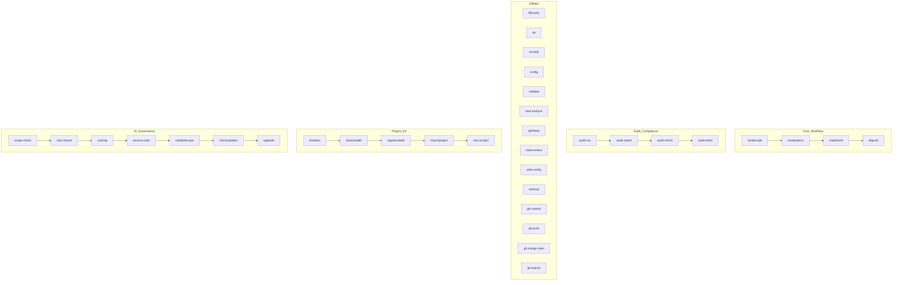

# wxHelp — Show Available wxAI Commands

This reference provides a visual and categorized list of all available wxAI commands for the wxKanban Project Hub.

---

## wxAI Command List

- buildscope — Guided scope drafting
- createspecs — Create specs and enforce test plan
- implement — Execute implementation plan
- dbpush — Validate and push all data to database
- audit-run, audit-report, audit-check, audit-tasks — Audit and compliance
- lifecycle, qa, help (wxHelp), config, validate, task-analyze, gateway, clearcontext, web-config, cleanup, git-commit, git-push, git-merge-main, git-branch — Utilities
- kitstatus, downloadkit, regeneratekit, importproject, new-project — Project Kit
- scope-check, todo-import, training, session-start, validatescope, checkupdates, upgrade — AI Governance

> For details on each command, see the full help.md or run `wxHelp <command>`.
