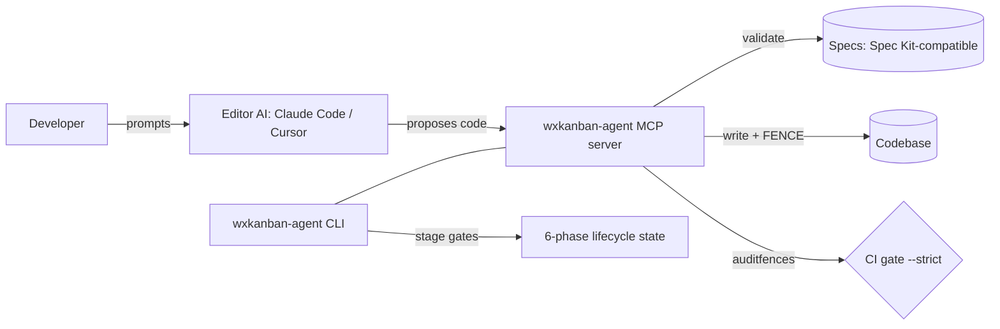

# Orchestrator Kit — Landscape Research & Phased PRD

**Subject:** `wxkanban-agent` orchestrator kit (CLI + MCP server), *not* the wxKanban app.
**Date:** 2026-06-09
**Status:** Working doc — for review/edit.
**Method:** Deep-research workflow (19 sources fetched, 91 claims extracted, 25 adversarially verified, 24 confirmed / 1 killed). Columns marked **[V]** are research-verified; **[K]** are from my own knowledge (Jan-2026 cutoff) and need a 60-sec spot-check before anyone bets on them — second-tier license/maturity data was *not* independently verified.

---

## TL;DR (read this first)

1. **Spec-first is table stakes, not a differentiator.** The SDD ecosystem already has 13+ distinct tools, led by GitHub Spec Kit (MIT, shipping near-daily). Leading the kit's pitch with "no code without a spec" puts it in a crowded race against a fast-moving incumbent it cannot out-ship. **[V]**
2. **Code-fencing / spec→code provenance is the defensible moat.** Every spec-first competitor stops at *doc-level* traceability. None annotate the *generated code* with the authoring spec+task and audit it. Demand is real but unmet (Kiro issue #7061 requests exactly this). The only analogs are an academic preprint (ReqToCode) and legacy requirements tools (itemis/Reqflow) — neither targets AI-generated code in an editor-AI workflow. **[V, high confidence]**
3. **The educational on-ramp is a second, softer moat.** Existing SDLC education is generic course theory (Coursera/UMN). Nobody embeds methodology-teaching *inside the tooling that does the work*. Harder to defend than fencing, but it's a real positioning gap. **[V, medium confidence]**
4. **The MCP-PM/lifecycle niche is open.** Anthropic's official reference servers omit PM/spec/lifecycle entirely — that space is community-only and fragmented. **[V]**

**Strategic implication:** reposition the kit's headline from *"spec-driven development"* (commodity) to *"provenance-enforced, teach-as-you-build development"* (uncontested). Treat Spec Kit as the spec-authoring layer to interoperate with, not to replace.

---

## Phase 1 — Landscape

### Category 1: Spec-driven / spec-first frameworks (the crowded core)

| Name | Type | Link | What it does | Overlap | License | Maturity | Reusable? |
|---|---|---|---|---|---|---|---|
| **GitHub Spec Kit** | CLI | [github/spec-kit](https://github.com/github/spec-kit) | Scaffolds specs as source of truth; `/specify`→`/plan`→`/tasks` flow driving an editor AI | Direct — spec-first lifecycle, CLI, drives editor AI **[V]** | MIT **[V]** | Dominant, near-daily releases **[V]** | **Interoperate** — adopt its spec format; do not compete on authoring |
| **Kiro** | IDE | [kirodotdev/Kiro](https://github.com/kirodotdev/Kiro) | AWS spec-driven IDE (requirements→design→tasks) | Lifecycle + spec gating | Commercial (AWS) **[K]** | Backed, active; users *requesting* code provenance (#7061) **[V]** | **Learn-from** — #7061 validates our moat |
| **Tessl** | Platform | tessl.io **[K]** | "Spec-as-source": edit specs, code regenerates | Spec-as-truth, but regenerates code (we preserve+fence human/AI code) **[V]** | Commercial **[K]** | Funded, early **[K]** | **Learn-from** — opposite philosophy; contrast in messaging |
| **BMad** | Framework | (awesome-SDD lists) **[K]** | Agent-driven SDD method/framework | Lifecycle method | OSS **[K]** | Active in SDD circles **[K]** | Learn-from |
| **OpenSpec** | Framework + MCP | [Lumiaqian/openspec-mcp](https://github.com/Lumiaqian/openspec-mcp) | Spec-anchored; specs persist/evolve; MCP exposes spec workflow w/ staged lifecycle (~33 tools) **[V]** | Strong — staged lifecycle + MCP | OSS **[K]** | Active **[K]** | **Integrate/learn** — closest architectural cousin |
| **Spec Kitty** | Framework | (SDD comparisons) **[K]** | Spec-anchored variant | Lifecycle | OSS **[K]** | Niche **[K]** | Learn-from |

### Category 2: AI agent orchestrators (CLI / multi-agent)

| Name | Type | Link | What it does | Overlap | License | Maturity | Reusable? |
|---|---|---|---|---|---|---|---|
| **Overstory** | OSS orchestrator | [jayminwest/overstory](https://github.com/jayminwest/overstory) | Multi-agent orchestration **with an explicit spec-writing step**; integrates multiple editor-AI clients **[V]** | High — multi-client + spec step, like us | OSS **[K]** | Active, niche **[K]** | **Learn-from** — validates "engine drives many editor AIs" |
| **Claude Flow** | Orchestrator | [analyticsvidhya overview](https://www.analyticsvidhya.com/blog/2026/03/claude-flow/) | Multi-agent Claude orchestration | Orchestration layer | OSS **[K]** | Active **[K]** | Learn-from |
| **awesome-agent-orchestrators** | List | [andyrewlee/...](https://github.com/andyrewlee/awesome-agent-orchestrators) | Curated orchestrator index | Discovery | — | Curated **[V]** | **Reference** — scan for new entrants |
| **awesome-cli-coding-agents** | List | [bradAGI/...](https://github.com/bradAGI/awesome-cli-coding-agents) | Curated CLI coding-agent index | Discovery | — | Curated **[V]** | **Reference** |

### Category 3: MCP servers (PM / spec / lifecycle)

| Name | Type | Link | What it does | Overlap | License | Maturity | Reusable? |
|---|---|---|---|---|---|---|---|
| **Anthropic reference servers** | MCP | [modelcontextprotocol/servers](https://github.com/modelcontextprotocol/servers) | 7 reference servers — **none PM/spec/lifecycle** **[V]** | Confirms the niche is open | MIT **[V]** | Official **[V]** | **Learn-from** — protocol patterns only |
| **spec-workflow-mcp** | MCP | [Pimzino/spec-workflow-mcp](https://github.com/Pimzino/spec-workflow-mcp) | MCP server implementing spec workflow w/ **approval gates**; **does NOT do code↔spec traceability** **[V]** | Very high — closest competitor; gap = our moat | OSS **[K]** | Active **[K]** | **Integrate/learn** — study, then beat on fencing |
| **mcp-shrimp-task-manager** | MCP | [cjo4m06/mcp-shrimp-task-manager](https://github.com/cjo4m06/mcp-shrimp-task-manager) | Structured task decomposition; plan→execute→verify **[V]** | High — task lifecycle | OSS **[K]** | Active **[K]** | **Learn-from** — task-decomp UX |
| **MCP Registry** | Registry | (separate registry exists **[V]**) | Discovery of public MCP servers | Distribution channel | — | Live **[V]** | **Integrate** — list the kit here |

### Category 4: Spec↔code traceability / provenance (the moat zone)

| Name | Type | Link | What it does | Overlap | License | Maturity | Reusable? |
|---|---|---|---|---|---|---|---|
| **ReqToCode** | Academic | [arxiv preprint](https://arxiv.org/html/2603.13999) | Embeds requirements traceability **into the dev process**, links reqs→code via source annotation **[V]** | Closest *concept* to fencing | Paper **[V]** | Single-author preprint — not production **[V]** | **Learn-from** — cite as prior art |
| **Tabnine provenance** | Commercial | [devops.com writeup](https://devops.com/tabnine-adds-ability-to-track-provenance-of-code-generated-by-ai-models/) | Tracks provenance of AI-generated code | Provenance, but model-origin not spec-origin | Commercial **[K]** | Shipping **[K]** | Learn-from — different axis (which *model*, not which *spec*) |
| **itemis / Reqflow** | Tools | (legacy RE tools) **[K]** | Inline requirements→artifact annotation/traceability | Inline annotation precedent | Mixed **[K]** | Mature, non-AI **[K]** | **Learn-from** — proves inline annotation works at scale |
| **Code-provenance-as-control** | Article | [nhimg.org](https://nhimg.org/articles/code-provenance-is-the-missing-control-for-ai-generated-commits/) | Argues provenance is the missing control for AI commits | Market validation | — | Opinion **[V]** | **Reference** — narrative ammunition |

### Category 5: Stage-gate / lifecycle enforcement
No dedicated AI-era incumbent surfaced. Enforcement lives *inside* the SDD frameworks above (OpenSpec staged lifecycle, spec-workflow-mcp approval gates). **Gap:** standalone, language-agnostic stage-gate enforcement tied to provenance is open.

### Category 6: Educational dev tooling
| Name | Type | Link | Overlap | Reusable? |
|---|---|---|---|---|
| **Coursera SDLC Specialization (UMN)** | Course | [coursera.org/...](https://www.coursera.org/specializations/software-development-lifecycle) | Teaches SDLC **concepts**, not embedded in tooling **[V]** | **Learn-from** — the gap is "teach *while* building" |

---

## Phase 2 — Synthesis

### Build vs. Buy vs. Integrate

| Feature area | Verdict | Rationale |
|---|---|---|
| Spec authoring/format | **Integrate** | Spec Kit owns this and out-ships everyone. Adopt/interop with its format; don't rebuild. |
| Lifecycle / stage-gates | **Build (thin)** | Our 6-phase gating is differentiated by being *provenance-aware*. Keep it, but lean on it as plumbing, not the headline. |
| **Code-fencing / spec→code provenance** | **Build — this is the product** | No competitor does it; demand is documented (Kiro #7061). This is where to invest. |
| MCP server (validate/write/fence/audit) | **Build** | The "engine, not AI client" + fencing combo is unique. Anthropic's niche is open; Pimzino is closest but lacks traceability. |
| Multi-editor-AI driving | **Learn-from (Overstory)** | Pattern is proven OSS; don't reinvent the orchestration shell, focus our effort above it. |
| Educational layer | **Build (defer)** | Genuine gap, but softer moat. Phase 2/3. |

### Gaps the kit can uniquely fill
1. **Spec→code provenance, audited.** Every line traceable to the spec+task that authored it, enforced by CI (`auditfences`). Nobody ships this for AI-generated code in an editor-AI workflow.
2. **Teach-as-you-build.** Methodology instruction embedded in the gates themselves — the kit *is* the curriculum (serves the educational mission directly).
3. **Provenance-aware stage-gates** as a standalone, language-agnostic capability.

### Risks
- **Spec Kit velocity** (high): MIT + GitHub distribution + near-daily releases. *Mitigation:* don't compete on spec authoring; interoperate, and differentiate on provenance + teaching.
- **Vendor lock-in / commodsourcing** (med): Kiro (AWS) or Spec Kit could ship file/line provenance and erase the moat. #7061 shows they're aware. *Mitigation:* move fast on fencing; make it the brand.
- **License conflicts** (low-med): most incumbents MIT/OSS — safe to learn from. **Verify second-tier licenses [K] before forking anything.**
- **Dead-prior-art trap** (low): ReqToCode is a single-author preprint, itemis/Reqflow are pre-AI. Cite as validation, don't depend on them.
- **MCP fragmentation** (low): list on the MCP Registry early to win discovery.

---

## Phase 3 — Phased PRD

### 1. Overview
- **Problem:** AI-generated code has no provenance — teams (and learners) can't answer "which requirement authored this line, and was it approved?" Spec-first tools stop at the doc; the code is unaccountable. Separately, career-changing/non-AI developers lack a tool that *teaches* lifecycle discipline while they build.
- **Target users:** (a) teams wanting auditable, spec-traceable AI codegen; (b) the educational beachhead — WinDev/PCSoft converts & career-changers learning lifecycle methodology zero-to-release.
- **Success metrics:** % of repo under valid fences (`auditfences` clean rate); spec→task→code traceability coverage; learner progression through the 6 phases without bypassing gates.

### 2. Scope by Phase

**Phase 1 — MVP (minimum lovable product) — 3–5 features only**
1. **Code fencing + `auditfences`** — the headline. BEGIN/END provenance fences, written by the orchestrator only, audited (exit 0 = clean), CI `--strict`.
2. **MCP server: validate→write→fence→audit** — engine drives the user's editor AI (Claude Code/Cursor); kit never generates code.
3. **Minimal spec-first gate** — interoperate with Spec Kit-style specs; one approval gate before implement.
4. **`implement` command** — the one path that authors fenced code.
- *Tech leverage:* learn orchestration shell from **Overstory**; MCP patterns from Anthropic reference servers + **Pimzino/spec-workflow-mcp**; spec format from **Spec Kit**.
- *Out of scope (explicit):* full 6-phase lifecycle UI, educational content, multi-spec PRDs, QA/Beta/Release automation, the kanban app integration.
- *Acceptance:* a repo can be fully fenced, `auditfences --strict` passes in CI, and every code unit links to a spec+task.

**Phase 2 — Expansion**
- Full 6-phase stage-gates (Design→…→Release), provenance-aware.
- `runqa` / `runhuman` / `prepareRelease` / `finalizeRelease`.
- MCP Registry listing + multi-editor-AI support (Cursor + Claude Code).
- *Depends on:* Phase 1 fencing + MCP foundation.

**Phase 3 — Advanced**
- **Educational layer** — methodology taught inside the gates; the kit as curriculum.
- Multi-agent orchestration for larger scopes; observability/dashboards on provenance coverage.
- Scale/perf, audit-report generation, traceability analytics.

### 3. Architecture Sketch

- **Data model outline:** Spec → Task → FencedCodeUnit (BEGIN/END w/ spec+task id, MODIFIED-BY chain); LifecyclePhase state per scope; AuditResult.
- **External integrations per phase:** P1 — editor AIs via MCP, Spec Kit format. P2 — MCP Registry, CI providers. P3 — analytics/observability.

### 4. Open Questions / Decisions Needed
1. **Positioning:** confirm reposition from "spec-driven dev" → "provenance-enforced, teach-as-you-build." (My recommendation: yes.)
2. **Spec format:** adopt Spec Kit's format for interop, or keep the kit's own and import? (Recommend: interop.)
3. **Educational layer timing:** Phase 3 as drafted, or pull a lightweight version into Phase 1 given it's core to the mission?
4. **Provenance granularity:** stay at top-level-unit fences, or add file/line provenance to pre-empt Kiro #7061 / Tessl?
5. **Distribution:** when to list on the MCP Registry — Phase 1 (land-grab) or Phase 2?

### 5. Appendix
- Full landscape tables above (Categories 1–6).
- **Repos worth cloning/studying:** [Pimzino/spec-workflow-mcp](https://github.com/Pimzino/spec-workflow-mcp) (closest competitor), [Lumiaqian/openspec-mcp](https://github.com/Lumiaqian/openspec-mcp) (staged lifecycle cousin), [jayminwest/overstory](https://github.com/jayminwest/overstory) (multi-client orchestration), [cjo4m06/mcp-shrimp-task-manager](https://github.com/cjo4m06/mcp-shrimp-task-manager) (task decomp), [github/spec-kit](https://github.com/github/spec-kit) (the incumbent to interop with).
- **Prior art for the moat:** [ReqToCode preprint](https://arxiv.org/html/2603.13999), [Kiro #7061](https://github.com/kirodotdev/Kiro/issues/7061), [code-provenance article](https://nhimg.org/articles/code-provenance-is-the-missing-control-for-ai-generated-commits/).

---
*Research caveats:* Spec Kit ships near-daily (re-check before release decisions). ReqToCode is a single-author preprint. OpenSpec MCP is ~33 tools (not 40+). The tidy "3-level SDD maturity taxonomy" was **refuted** in verification — don't cite it. Second-tier license/maturity cells marked **[K]** are unverified.
