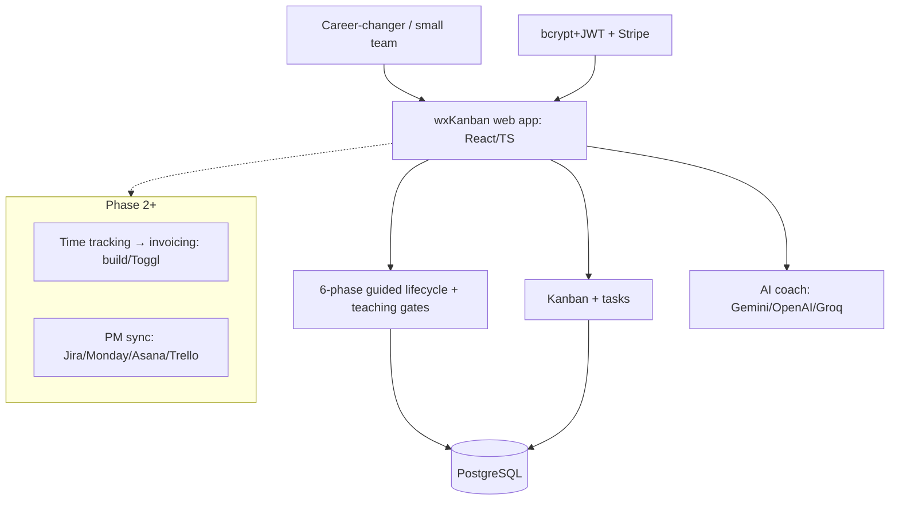

# wxKanban (the app) — Landscape Research & Phased PRD

**Subject:** the wxKanban product (kanban + PM-sync + time-tracking/invoicing + AI + embedded SDLC teaching). *Not* the orchestrator kit — see [orchestrator-kit-landscape-prd.md](orchestrator-kit-landscape-prd.md) for that.
**Date:** 2026-06-09
**Status:** Working doc — for review/edit.
**Framing:** Differentiator-first (per request) — anchored on the three hypothesized wedges; commodity areas mapped only enough to make build-vs-buy calls.
**Method:** Deep-research workflow (22 sources fetched, 95 claims extracted, 25 adversarially verified, 23 confirmed / 2 killed). **[V]** = research-verified; **[K]** = my own knowledge (Jan-2026 cutoff), spot-check before betting on it.

---

## TL;DR (read this first)

The research tested wxKanban's three hypothesized differentiators. **Two are already commodities. One is genuinely uncontested — and it's the educational mission you already care about.**

1. **AI-in-PM is NOT a wedge — it's table stakes.** Atlassian Rovo (3M+ users, **bundled free** into every paid Jira/Confluence/JSM Cloud plan, 70+ connectors, action-taking agents that create/edit issues) and Asana AI Teammates (assignable, Work-Graph-aware agents doing real knowledge work) already ship what wxKanban's AI layer aspires to. Treat AI as **BUY/table-stakes**, not a moat. **[V, high]**
2. **PM-system sync is a solved, purchasable commodity.** Unito does real-time two-way sync across 60+ tools. Your narrow 4-system (Jira/Monday/Asana/Trello) scope is *buildable*, but breadth/reliability is a bought problem — and Rovo's 70+ connectors are eating "single pane of glass" too. **INTEGRATE or keep narrow; don't chase breadth.** **[V, high]**
3. **Time-tracking → invoicing is fully commoditized.** Toggl Track: free public API, 100+ integrations, native invoicing with QuickBooks export. **Clear BUY/INTEGRATE.** **[V, high]**
4. **THE WEDGE — "PM + teach-the-software-lifecycle for career-changers" is unfilled.** The closest adjacent product, **GitHub Spec Kit**, is a CLI explicitly for *senior* developers ("Junior developers cannot produce this in a day"), with no PM tooling, no PM-system connectors, and no teaching mission. OSS PM apps (Plane, Vikunja, Focalboard) have no SDLC-teaching layer. Nobody combines an integrated PM tool with guided lifecycle pedagogy aimed at non-AI / career-changing developers. **[V, high]**

**Strategic implication:** wxKanban should NOT position or invest as "another AI PM tool with integrations." It should position as **the project-management tool that teaches you to build software the right way** — and treat AI, sync, and invoicing as supporting commodity features bought/built cheaply, not as the headline. This aligns directly with the documented educational mission.

> ⚠️ **Threat to watch:** GitHub/Microsoft (Spec Kit) is commoditizing the *methodology-scaffolding* layer. wxKanban must defend on **teaching + integrated PM for beginners**, not on spec-driven workflow mechanics alone — that race goes to GitHub.

---

## Phase 1 — Landscape

### Angle 1: AI-in-PM incumbents (verdict: BUY / table-stakes — strong, fast incumbents)

| Name | Type | Link | What its AI does | Overlap | Pricing | Maturity | Call |
|---|---|---|---|---|---|---|---|
| **Atlassian Rovo** | SaaS (Jira/Confluence) | [atlassian.com/software/rovo](https://www.atlassian.com/software/rovo) · [agents docs](https://support.atlassian.com/rovo/docs/agents/) | Search + Chat + **action-taking Agents** that create/edit Jira issues & Confluence pages; any user can build custom agents w/ own knowledge sources/subagents | Direct on AI-assistant axis | **Bundled free** in all Standard/Premium/Enterprise Cloud plans **[V]** | 3M+ monthly users, 70+ connectors (GitHub, GitLab, Azure DevOps, Figma, Google, MS) **[V]** | **Learn-from / treat as table-stakes** |
| **Asana AI Teammates** | SaaS | [asana.com/product/ai/ai-teammates](https://asana.com/product/ai/ai-teammates) | Pre-built + custom agents **assignable like humans**; Work-Graph context; content creation, research synthesis, data analysis, risk flagging **[V]** | Direct | Paid tiers **[K]** | GA-class, well-funded **[V]** | **Learn-from** |
| Linear / Monday / Notion / ClickUp Brain | SaaS | — | AI assistants/agents (not independently verified here) **[K]** | Direct | Paid **[K]** | Active **[K]** | Learn-from |

*Note: a "ClickUp Brain Super Agents" capability claim was **refuted** (0-3) in verification — don't cite it.*

### Angle 2: PM-system sync / aggregation (verdict: INTEGRATE for breadth, or keep narrow)

| Name | Type | Link | What it does | Overlap | Pricing | Call |
|---|---|---|---|---|---|---|
| **Unito** | Integration platform | [unito.io](https://unito.io/platform-overview) · [pricing](https://unito.io/pricing/) | Real-time two-way sync across 60+ tools (Asana, Jira, Trello, Azure DevOps, ServiceNow, Salesforce, Smartsheet) **[V]** | Only on the sync function — no kanban/time/AI/SDLC | **Metered per item-in-sync** (each item counts twice) → lock-in risk **[V]** | **Integrate** for breadth; **build** for your fixed 4-system scope |
| Whalesync / n8n / Zapier / Make / Exalate | Platforms | — | Sync/automation alternatives (not deeply verified) **[K]** | Sync only | Varies **[K]** | Integrate/learn |

### Angle 3: Time-tracking → invoicing (verdict: BUY / INTEGRATE — fully commoditized)

| Name | Type | Link | What it does | Pricing | Call |
|---|---|---|---|---|---|
| **Toggl Track** | SaaS | [toggl.com/track/integrations](https://toggl.com/track/integrations/) · [API](https://support.toggl.com/en/articles/2559637-do-you-have-an-api-available) | Timers + **free public API** (no paid plan needed), 100+ integrations (Jira/Asana/Trello/ClickUp/Notion/Monday/Linear), **native invoicing → QuickBooks export** **[V]** | Free API; paid tiers for features **[V]** | **Integrate / learn-from** |
| Harvest / Clockify / Everhour | SaaS | — | Time + invoicing alternatives **[K]** | Varies **[K]** | Buy/integrate |

*Note: a "Harvest has native invoicing, Toggl doesn't" claim was **refuted** (0-3) — both do invoicing; don't rely on that asymmetry.*

### Angle 4: OSS kanban/PM apps (verdict: LEARN-FROM only — AGPL blocks forking into a proprietary SaaS)

| Name | Link | License | Maturity | AI? | SDLC-teaching? | Call |
|---|---|---|---|---|---|---|
| **Plane** | [github.com/makeplane/plane](https://github.com/makeplane/plane) | **AGPL-3.0** **[V]** | ~50.6k★, 4.5k forks, v1.3.1 (May 2026), active **[V]** | No | No **[V]** | **Learn-from** (UI/data-model). Fork-into-proprietary blocked by AGPL §13 without legal review |
| **Vikunja** | [vikunja.io](https://vikunja.io/) | **AGPLv3** **[V]** | Active, free self-host + paid Cloud | **No AI** **[V]** | No | Learn-from |
| **Focalboard** | [github/...focalboard](https://github.com/mattermost-community/focalboard) | AGPL-3.0 **[V]** | Standalone **unmaintained** (last v8.0.0 Jun 2024; moved to mattermost-plugin-boards) **[V]** | No | No | Learn-from (lower priority — stale) |

⚠️ **License risk:** AGPL network-copyleft (§13) forces source disclosure for network-served modifications — **hostile to a closed, Stripe-billed SaaS.** Learn from patterns; do not fork into wxKanban without counsel. **[V, flagged not settled]**

### Angle 5: PM + embedded SDLC teaching (verdict: GAP CONFIRMED — this is the wedge)

| Name | Link | What it does | Why it's NOT a competitor (yet) |
|---|---|---|---|
| **GitHub Spec Kit** | [spec-kit](https://github.com/github/spec-kit) · [announce](https://github.blog/ai-and-ml/generative-ai/spec-driven-development-with-ai-get-started-with-a-new-open-source-toolkit/) | Specify→Plan→Tasks→Implement spec-driven workflow; spec as "source of truth" feeding coding agents (Copilot/Claude Code/Gemini CLI) **[V]** | **CLI for senior devs** ("Junior developers cannot produce this"); **no** kanban/time/invoicing/PM-sync/hosting/auth; **no** PM-tool connectors; **no** teaching mission **[V]** |
| **Plane for Education** | [plane.so/education](https://plane.so/education) | Workplace PM tool used on campus | "Same tools teams use beyond campus" — **not lifecycle pedagogy** **[V]** |

---

## Phase 2 — Synthesis

### Build vs. Buy vs. Integrate

| Feature area | Verdict | Rationale |
|---|---|---|
| Kanban boards | **Build (thin) / learn-from** | Commodity. Match Plane/Focalboard patterns; don't over-invest. |
| AI assistant in PM | **Buy-pattern / table-stakes** | Rovo+Asana already ship action-taking agents free/bundled. Have *enough* AI to not look behind; don't try to out-AI Atlassian. |
| PM-system sync (4 tools) | **Build narrow OR integrate** | Your fixed Jira/Monday/Asana/Trello + OAuth2/polling scope is viable to build. For breadth, integrate Unito-class. Don't chase 60-tool breadth. |
| Time tracking → invoicing | **Integrate (Toggl) / build minimal** | Fully commoditized, free APIs. Build only the thin slice you need for the teaching loop; integrate the rest. |
| **Embedded SDLC teaching** | **BUILD — this is the product** | Uncontested. The 6-phase guided lifecycle + judgment-building for career-changers is the moat. Invest here. |

### Gaps wxKanban can uniquely fill
1. **Guided, integrated "learn-the-lifecycle-while-you-build" PM tool** for non-AI / career-changing developers — confirmed empty.
2. **Methodology pedagogy embedded in a real working tool** (not a course, not a senior-dev CLI) — the Spec-Kit-vs-bootcamp gap.
3. **Lifecycle gates that teach judgment**, not just enforce process — the "critical thinking is the job" thesis has no tooling competitor.

### Risks
- **GitHub Spec Kit commoditizing methodology scaffolding** (high): Microsoft-backed, fast. *Mitigation:* don't compete on spec-driven *mechanics*; own **teaching + integrated PM for beginners**. If Spec Kit adds PM connectors or a learning mode, the wedge narrows — watch the roadmap.
- **AI-in-PM incumbents** (high but off-axis): only a threat if wxKanban positions *as* an AI PM tool. Reposition around teaching and this de-risks.
- **AGPL license traps** (med): no forking Plane/Vikunja/Focalboard into the SaaS without legal review.
- **Crowded commodity layers** (med): kanban/time/invoicing are red oceans — every hour spent competing there is an hour not spent on the moat.
- **Integration-platform lock-in** (low-med): Unito's per-item metering raises switching cost if you integrate rather than build sync.

---

## Phase 3 — Phased PRD

### 1. Overview
- **Problem:** career-changing / non-AI developers (WinDev/PCSoft converts, ex-tradespeople) can *think* systemically but lack software-engineering vocabulary, habits, and judgment. Existing tools either assume senior expertise (Spec Kit), teach abstract theory detached from real work (Coursera/bootcamps), or are pure productivity PM tools with no pedagogy (Jira/Asana/Plane). Nothing **teaches the lifecycle inside a real, integrated PM tool**.
- **Target users:** career-changers ~1 year in who are already systems thinkers; secondarily small teams/consultancies who want lifecycle discipline + light PM + billing in one place.
- **Success metrics:** learner progression through all 6 phases without bypassing gates; judgment indicators (quality of specs/decisions over time), not just task throughput; retention through a full project zero→release.

### 2. Scope by Phase

**Phase 1 — MVP (minimum lovable product) — 3–5 features**
1. **Guided 6-phase lifecycle with teaching gates** — Design→Implementation→QA→HumanTesting→Beta→Release, where each gate *explains the why* and builds judgment. **This is the headline.**
2. **Kanban board + tasks** tied to the lifecycle (thin; learn from Plane patterns).
3. **Minimal AI assistant** — enough to guide/coach within gates (table-stakes parity, not an AI arms race). Reuse existing Gemini/OpenAI/Groq layer.
4. **Auth + billing** (existing bcrypt/JWT + Stripe).
- *Tech leverage:* learn kanban/data-model from **Plane/Focalboard** (no fork — AGPL); AI = existing provider layer.
- *Out of scope (explicit):* PM-system sync, invoicing, broad integrations, multi-tool aggregation, advanced AI agents.
- *Acceptance:* a career-changer can take a project zero→release through all 6 phases, guided and gated, learning the methodology as they go.

**Phase 2 — Expansion**
- **Time tracking → invoicing** (build minimal or integrate Toggl) for the consultancy segment.
- **Narrow PM-system sync** (Jira/Monday/Asana/Trello, OAuth2+polling) for users straddling existing tools.
- Richer AI coaching; progress/judgment analytics for learners.
- *Depends on:* Phase 1 lifecycle + task model.

**Phase 3 — Advanced**
- Deeper pedagogy: adaptive teaching paths, judgment scoring, cohort/mentor features.
- Broader integrations (Unito-class) if breadth demand proven.
- Observability on learning outcomes; possible curriculum/certification layer.

### 3. Architecture Sketch

- **Data model outline:** Project → LifecyclePhase → Spec → Task → (time entries, invoices in P2); learner-progress/judgment records as a first-class entity.
- **External integrations per phase:** P1 — LLM providers, Stripe. P2 — Toggl/QuickBooks, PM-system OAuth. P3 — broader sync, analytics.

### 4. Open Questions / Decisions Needed
1. **Positioning:** confirm the reposition from "AI PM tool w/ integrations" → **"the PM tool that teaches you to build software"**. (Recommend: yes — it's the only defensible wedge and matches the mission.)
2. **AI ambition:** explicitly cap AI at "coaching/table-stakes parity" for Phase 1 rather than competing with Rovo? (Recommend: yes.)
3. **Sync build-vs-buy crossover:** for the narrow 4-system scope, build vs. embed Unito/n8n/Exalate given per-item metering? (Needs a cost spike — flagged as research open question.)
4. **Spec Kit threat:** monitor whether GitHub adds PM connectors or a learning mode — would directly encroach. Assign someone to watch the roadmap.
5. **Ed-tech adjacency:** the research did **not** cover bootcamps/Codecademy/Scrimba — confirm none are shipping a guided-SDLC PM tool before locking the "uncontested" claim. (Flagged open question.)

### 5. Appendix
- Full landscape tables above (Angles 1–5).
- **Worth studying (learn-from, no fork):** [Plane](https://github.com/makeplane/plane) (UI/data model), [Focalboard](https://github.com/mattermost-community/focalboard) (board UX), [Toggl Track](https://toggl.com/track/integrations/) (time→invoice patterns), [Atlassian Rovo](https://www.atlassian.com/software/rovo) + [Asana AI Teammates](https://asana.com/product/ai/ai-teammates) (AI-in-PM table-stakes bar).
- **Wedge / threat references:** [GitHub Spec Kit](https://github.com/github/spec-kit) + [announcement](https://github.blog/ai-and-ml/generative-ai/spec-driven-development-with-ai-get-started-with-a-new-open-source-toolkit/), [Plane for Education](https://plane.so/education).

---
*Research caveats:* AI-in-PM features and Spec Kit are 2025–2026 releases evolving monthly — re-verify Rovo's free bundling, Asana Teammates GA, and Spec Kit's roadmap before locking the PRD. Vendor-primary sources confirm *feature existence and pricing*, **not** output quality — no independent AI-agent quality benchmarks were gathered. Two claims were **refuted** and excluded (Harvest-vs-Toggl invoicing asymmetry; ClickUp "Super Agents") — don't cite either. AGPL constraints are flagged for legal review, not settled opinion. Commodity-layer coverage (Linear/Monday/Notion AI, Whalesync/n8n/Zapier, Harvest/Clockify/Everhour, ed-tech adjacency) is intentionally thin per the differentiator-first framing — see open questions #3 and #5.
